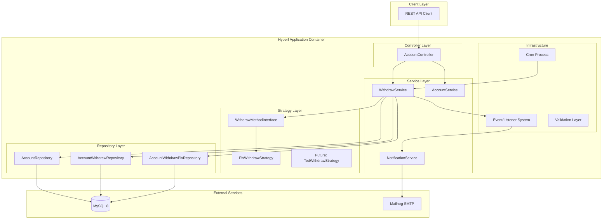

# Design Document

## Overview

This design document outlines the technical architecture for a high-performance PIX withdrawal microservice built with Hyperf 3.x framework. The system implements a layered architecture with strict separation of concerns, utilizing Strategy pattern for extensible withdrawal methods and robust concurrency control to ensure data integrity in high-throughput scenarios.

The microservice is designed to handle both immediate and scheduled PIX withdrawals while maintaining ACID properties and preventing race conditions through pessimistic locking mechanisms.

**DESIGN PRINCIPLES FOCUSED ON CASE REQUIREMENTS:**
- **Performance First**: Sub-200ms response times, optimized database queries, connection pooling
- **Observability Built-in**: Structured logging, metrics collection, distributed tracing
- **Horizontal Scale Ready**: Stateless design, atomic operations, leader election for cron jobs
- **Security by Design**: Input validation, SQL injection prevention, secure error handling
- **Zero Host Dependencies**: Complete Docker containerization with reproducible builds

## Architecture

### System Architecture



### Layered Architecture

1. **Controller Layer**: HTTP request handling and response formatting
2. **Service Layer**: Business logic orchestration and transaction management
3. **Strategy Layer**: Pluggable withdrawal method implementations
4. **Repository Layer**: Data access abstraction with ORM integration
5. **Infrastructure Layer**: Cross-cutting concerns (events, validation, scheduling)

## Components and Interfaces

### Core Interfaces

#### WithdrawMethodInterface
```php
interface WithdrawMethodInterface
{
    public function supports(string $method): bool;
    public function validate(WithdrawRequestDto $request): ValidationResult;
    public function process(Account $account, AccountWithdraw $withdraw): ProcessResult;
    public function getRequiredFields(): array;
}
```

#### Repository Interfaces
```php
interface AccountRepositoryInterface
{
    public function findByIdForUpdate(string $id): ?Account;
    public function updateBalance(string $id, float $newBalance): bool;
}

interface AccountWithdrawRepositoryInterface
{
    public function create(AccountWithdraw $withdraw): AccountWithdraw;
    public function findPendingScheduled(int $limit = 50): Collection;
    public function updateStatusAtomically(string $id, string $fromStatus, string $toStatus): bool;
}
```

### Service Components

#### WithdrawService
Primary orchestrator for withdrawal operations:
- Coordinates between repositories and strategies
- Manages database transactions
- Handles concurrency control
- Triggers events for notifications

#### AccountService
Manages account-related operations:
- Balance validation and updates
- Account retrieval with locking
- Balance history tracking

#### NotificationService
Handles asynchronous notifications:
- Email composition and sending
- Event-driven notification processing
- Integration with Mailhog for testing

### Strategy Implementations

#### PixWithdrawStrategy
Implements PIX-specific withdrawal logic:
- PIX key validation (CPF, email, phone, random key)
- PIX transaction processing
- PIX-specific error handling

## Data Models

### Database Schema

#### Account Table
```sql
CREATE TABLE account (
    id CHAR(36) PRIMARY KEY,
    name VARCHAR(255) NOT NULL,
    balance DECIMAL(15,2) NOT NULL DEFAULT 0.00,
    created_at TIMESTAMP DEFAULT CURRENT_TIMESTAMP,
    updated_at TIMESTAMP DEFAULT CURRENT_TIMESTAMP ON UPDATE CURRENT_TIMESTAMP,
    INDEX idx_balance (balance)
) ENGINE=InnoDB;
```

#### Account Withdraw Table
```sql
CREATE TABLE account_withdraw (
    id CHAR(36) PRIMARY KEY,
    account_id CHAR(36) NOT NULL,
    method VARCHAR(50) NOT NULL,
    amount DECIMAL(15,2) NOT NULL,
    scheduled BOOLEAN NOT NULL DEFAULT FALSE,
    scheduled_for DATETIME NULL,
    status ENUM('PENDING', 'PROCESSING', 'DONE', 'REJECTED') NOT NULL DEFAULT 'PENDING',
    error_reason TEXT NULL,
    created_at TIMESTAMP DEFAULT CURRENT_TIMESTAMP,
    updated_at TIMESTAMP DEFAULT CURRENT_TIMESTAMP ON UPDATE CURRENT_TIMESTAMP,
    processed_at TIMESTAMP NULL,
    FOREIGN KEY (account_id) REFERENCES account(id),
    INDEX idx_status_scheduled (status, scheduled_for),
    INDEX idx_account_status (account_id, status),
    INDEX idx_processing_queue (status, scheduled_for, created_at)
) ENGINE=InnoDB;
```

#### Account Withdraw PIX Table
```sql
CREATE TABLE account_withdraw_pix (
    id CHAR(36) PRIMARY KEY,
    account_withdraw_id CHAR(36) NOT NULL,
    type ENUM('CPF', 'EMAIL', 'PHONE', 'RANDOM') NOT NULL,
    key VARCHAR(255) NOT NULL,
    created_at TIMESTAMP DEFAULT CURRENT_TIMESTAMP,
    FOREIGN KEY (account_withdraw_id) REFERENCES account_withdraw(id) ON DELETE CASCADE,
    INDEX idx_withdraw_id (account_withdraw_id)
) ENGINE=InnoDB;
```

### Entity Models

#### Account Entity
```php
class Account extends Model
{
    protected string $keyType = 'string';
    public bool $incrementing = false;
    
    protected array $fillable = ['id', 'name', 'balance'];
    protected array $casts = ['balance' => 'decimal:2'];
    
    public function withdrawals(): HasMany
    {
        return $this->hasMany(AccountWithdraw::class);
    }
    
    public function hasBalance(float $amount): bool
    {
        return $this->balance >= $amount;
    }
}
```

### DTOs (Data Transfer Objects)

#### WithdrawRequestDto
```php
class WithdrawRequestDto
{
    public function __construct(
        public readonly string $method,
        public readonly float $amount,
        public readonly string $pixKey,
        public readonly string $pixType,
        public readonly ?DateTime $scheduledFor = null
    ) {}
}
```

#### ProcessResultDto
```php
class ProcessResultDto
{
    public function __construct(
        public readonly bool $success,
        public readonly ?string $errorMessage = null,
        public readonly ?array $metadata = null
    ) {}
}
```

## Error Handling

### Exception Hierarchy

```php
abstract class WithdrawException extends Exception {}

class InsufficientBalanceException extends WithdrawException {}
class InvalidPixKeyException extends WithdrawException {}
class ConcurrencyException extends WithdrawException {}
class SchedulingException extends WithdrawException {}
```

### Error Response Format

```json
{
    "success": false,
    "error": {
        "code": "INSUFFICIENT_BALANCE",
        "message": "Account balance is insufficient for this withdrawal",
        "details": {
            "requested_amount": 100.00,
            "available_balance": 50.00
        }
    }
}
```

### Concurrency Control Strategy

#### Pessimistic Locking Implementation
```php
public function processWithdraw(string $accountId, WithdrawRequestDto $request): ProcessResult
{
    return Db::transaction(function () use ($accountId, $request) {
        // Lock account record to prevent concurrent modifications
        $account = $this->accountRepository->findByIdForUpdate($accountId);
        
        if (!$account) {
            throw new AccountNotFoundException();
        }
        
        if (!$account->hasBalance($request->amount)) {
            throw new InsufficientBalanceException();
        }
        
        // Process withdrawal with locked account
        return $this->executeWithdraw($account, $request);
    });
}
```

#### Atomic Status Updates for Scheduled Withdrawals
```php
public function reserveScheduledWithdrawals(int $limit = 50): Collection
{
    // Atomic update to prevent duplicate processing across containers
    $sql = "UPDATE account_withdraw 
            SET status = 'PROCESSING', updated_at = NOW() 
            WHERE status = 'PENDING' 
            AND scheduled_for <= NOW() 
            AND scheduled = TRUE 
            LIMIT ?";
    
    $affected = Db::update($sql, [$limit]);
    
    return $this->findByStatus('PROCESSING');
}
```

## Testing Strategy

### Unit Testing

#### Service Layer Tests
- Mock repository dependencies
- Test business logic isolation
- Validate exception handling
- Test DTO transformations

#### Strategy Pattern Tests
- Test each withdrawal method independently
- Validate PIX key formats
- Test validation logic
- Mock external service calls

#### Repository Tests
- Test database interactions
- Validate query performance
- Test transaction boundaries
- Test concurrency scenarios

### Integration Testing

#### API Endpoint Tests
```php
class WithdrawControllerTest extends TestCase
{
    public function testImmediateWithdrawSuccess(): void
    {
        // Setup test account with sufficient balance
        // Send POST request to /account/{id}/balance/withdraw
        // Assert successful response and balance update
    }
    
    public function testScheduledWithdrawCreation(): void
    {
        // Test scheduled withdrawal creation
        // Validate PENDING status
        // Ensure no immediate balance change
    }
    
    public function testConcurrentWithdrawPrevention(): void
    {
        // Simulate concurrent withdrawal requests
        // Validate only one succeeds
        // Ensure balance integrity
    }
}
```

#### Cron Job Tests
```php
class ProcessScheduledWithdrawTest extends TestCase
{
    public function testScheduledWithdrawProcessing(): void
    {
        // Create scheduled withdrawals
        // Run cron process
        // Validate status updates and balance changes
    }
    
    public function testMultiContainerSafety(): void
    {
        // Simulate multiple cron instances
        // Ensure no duplicate processing
    }
}
```

### Performance Testing

#### Load Testing Scenarios
- Concurrent withdrawal requests (100+ simultaneous)
- High-frequency scheduled withdrawal processing
- Database connection pool stress testing
- Memory usage under sustained load

#### Benchmarking Targets
- API response time: < 200ms for immediate withdrawals
- Scheduled withdrawal processing: 1000+ per minute
- Database query performance: < 50ms for account lookups
- Memory usage: < 512MB per container under normal load

### Email Testing with Mailhog

#### Development Setup
```yaml
# docker-compose.yml excerpt
mailhog:
  image: mailhog/mailhog:latest
  ports:
    - "1025:1025"  # SMTP
    - "8025:8025"  # Web UI
```

#### Email Integration Tests
```php
class NotificationServiceTest extends TestCase
{
    public function testWithdrawNotificationSent(): void
    {
        // Process withdrawal
        // Verify email queued
        // Check Mailhog for received email
        // Validate email content
    }
}
```

## Deployment Architecture

### Docker Configuration

#### Application Container
```dockerfile
FROM hyperf/hyperf:8.2-alpine-v3.18-swoole
WORKDIR /opt/www
COPY . /opt/www
RUN composer install --no-dev --optimize-autoloader
EXPOSE 9501
CMD ["php", "bin/hyperf.php", "start"]
```

#### Docker Compose Setup
```yaml
version: '3.8'
services:
  app:
    build: .
    ports:
      - "9501:9501"
    depends_on:
      - mysql
      - mailhog
    environment:
      - DB_HOST=mysql
      - MAIL_HOST=mailhog
    
  mysql:
    image: mysql:8.0
    environment:
      MYSQL_ROOT_PASSWORD: root
      MYSQL_DATABASE: pix_withdrawal
    volumes:
      - mysql_data:/var/lib/mysql
    
  mailhog:
    image: mailhog/mailhog:latest
    ports:
      - "8025:8025"
```

### Horizontal Scaling Considerations

#### Load Balancer Configuration
- Multiple application containers behind nginx/HAProxy
- Session-less design for stateless scaling
- Database connection pooling per container

#### Cron Job Distribution
- Leader election for scheduled job processing
- Distributed locking mechanisms
- Graceful shutdown handling

This design ensures a robust, scalable, and maintainable PIX withdrawal microservice that meets all production requirements while maintaining high performance and data integrity.